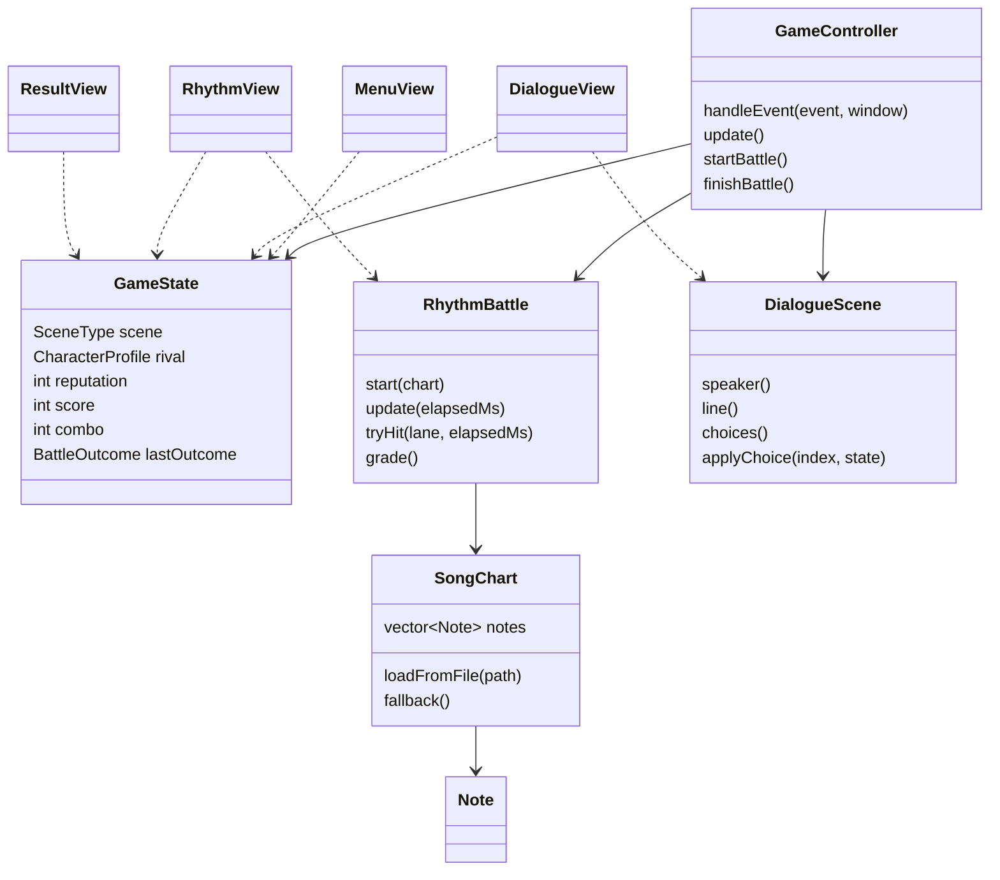
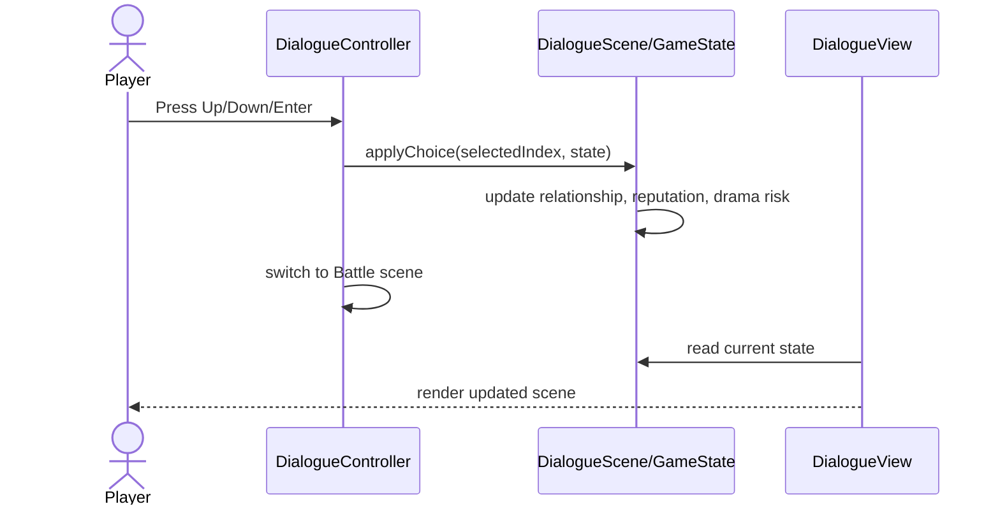
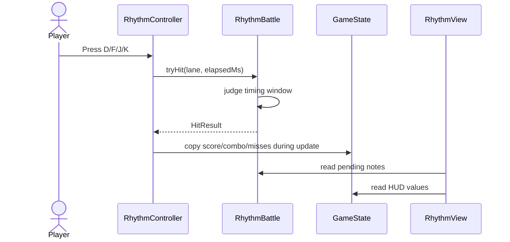
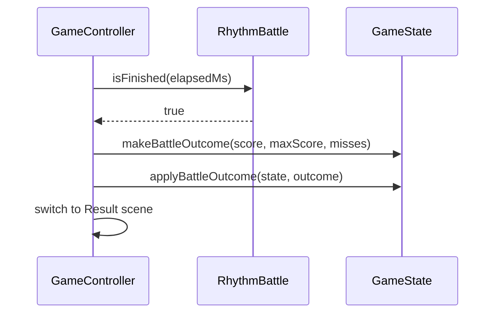

# MVC Design

## Class Diagram

```mermaid
classDiagram
    class GameState {
        SceneType scene
        CharacterProfile rival
        int reputation
        int score
        int combo
        BattleOutcome lastOutcome
    }

    class SongChart {
        vector~Note~ notes
        loadFromFile(path)
        fallback()
    }

    class RhythmBattle {
        start(chart)
        update(elapsedMs)
        tryHit(lane, elapsedMs)
        grade()
    }

    class DialogueScene {
        speaker()
        line()
        choices()
        applyChoice(index, state)
    }

    class GameController {
        handleEvent(event, window)
        update()
        startBattle()
        finishBattle()
    }

    class MenuView
    class DialogueView
    class RhythmView
    class ResultView

    GameController --> GameState
    GameController --> DialogueScene
    GameController --> RhythmBattle
    RhythmBattle --> SongChart
    SongChart --> Note
    MenuView ..> GameState
    DialogueView ..> DialogueScene
    DialogueView ..> GameState
    RhythmView ..> RhythmBattle
    RhythmView ..> GameState
    ResultView ..> GameState
```

## Dialogue Choice Sequence

```mermaid
sequenceDiagram
    actor Player
    participant Controller as DialogueController
    participant Model as DialogueScene/GameState
    participant View as DialogueView

    Player->>Controller: Press Up/Down/Enter
    Controller->>Model: applyChoice(selectedIndex, state)
    Model->>Model: update relationship, reputation, drama risk
    Controller->>Controller: switch to Battle scene
    View->>Model: read current state
    View-->>Player: render updated scene
```

## Rhythm Hit Sequence

```mermaid
sequenceDiagram
    actor Player
    participant Controller as RhythmController
    participant Battle as RhythmBattle
    participant State as GameState
    participant View as RhythmView

    Player->>Controller: Press D/F/J/K
    Controller->>Battle: tryHit(lane, elapsedMs)
    Battle->>Battle: judge timing window
    Battle-->>Controller: HitResult
    Controller->>State: copy score/combo/misses during update
    View->>Battle: read pending notes
    View->>State: read HUD values
```

## Battle Result Sequence

```mermaid
sequenceDiagram
    participant Controller as GameController
    participant Battle as RhythmBattle
    participant State as GameState

    Controller->>Battle: isFinished(elapsedMs)
    Battle-->>Controller: true
    Controller->>State: makeBattleOutcome(score, maxScore, misses)
    Controller->>State: applyBattleOutcome(state, outcome)
    Controller->>Controller: switch to Result scene
```
